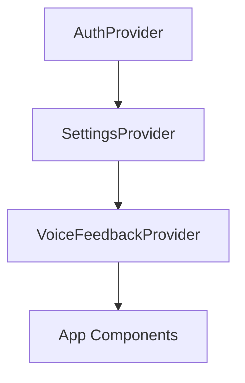

# Frontend - Next.js Application

**Port**: 3334 | **Framework**: Next.js 16, React 19, TypeScript, Tailwind CSS v4

## Quick Start

```bash
cd frontend
pnpm install
PORT=3334 pnpm dev
```

## Directory Structure

```
frontend/
├── app/                 # App router pages
├── components/          # UI components
├── hooks/               # Custom React hooks
├── contexts/            # React contexts (auth, settings, voice)
└── lib/                 # Utilities, API clients, STT
```

## Main Components

| Component | Purpose | Details |
|-----------|---------|---------|
| **TmuxController** | Terminal panel, role tabs, message input | [controller.md](./components/controller.md) |
| **FileBrowser** | File tree, code viewer, markdown | [file-browser.md](./components/file-browser.md) |
| **TeamCreator** | React Flow visual team editor | [team-creator.md](./components/team-creator.md) |
| **Voice** | Mic button, transcripts, feedback | [voice.md](./components/voice.md) |

## Hooks

| Hook | Purpose | Details |
|------|---------|---------|
| **useTeamState** | Team/role selection, activity polling | [team-hooks.md](./hooks/team-hooks.md) |
| **usePanePolling** | WebSocket pane output streaming | [team-hooks.md](./hooks/team-hooks.md) |
| **useTeamLifecycle** | Kill/restart/create operations | [team-hooks.md](./hooks/team-hooks.md) |
| **useVoiceRecorder** | Soniox STT, stop word detection | [voice-hooks.md](./hooks/voice-hooks.md) |

## Contexts

| Context | Purpose |
|---------|---------|
| **AuthContext** | JWT tokens, login/logout, user state |
| **SettingsContext** | Voice/theme settings, server sync |
| **VoiceFeedbackContext** | Global WebSocket, notifications, TTS playback |

## State Management



- **Auth** → JWT tokens in localStorage, auto-refresh
- **Settings** → localStorage + PostgreSQL sync
- **Voice** → WebSocket connection, notification queue

## API Communication

| Type | Pattern |
|------|---------|
| **REST** | Relative URLs `/api/...` → Next.js proxies to backend |
| **WebSocket** | Direct `ws://backend:17061/...` → bypasses Next.js |

## Testing

```bash
pnpm test           # Run Vitest
pnpm test:watch     # Watch mode
pnpm lint           # ESLint
pnpm build          # Production build
```

## Further Reading

- [Architecture Overview](../ARCHITECTURE.md) - System design
- [Backend Guide](../backend/README.md) - API endpoints
