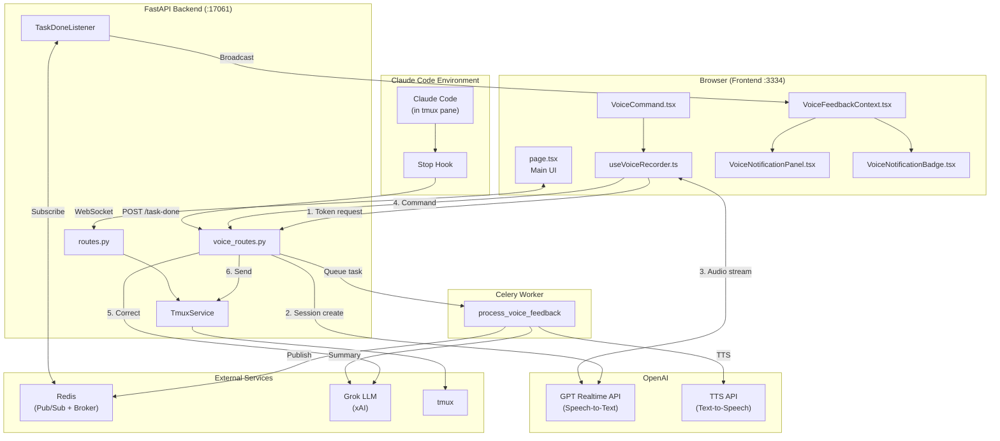
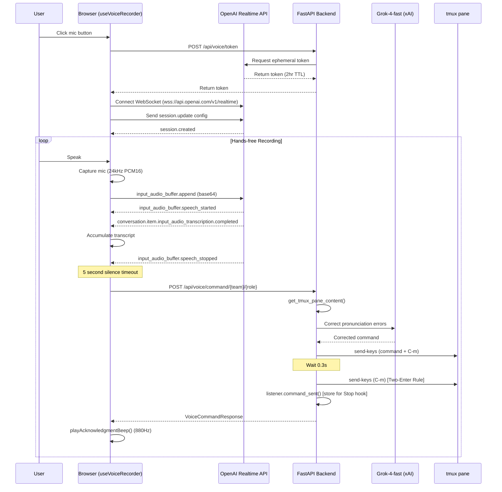
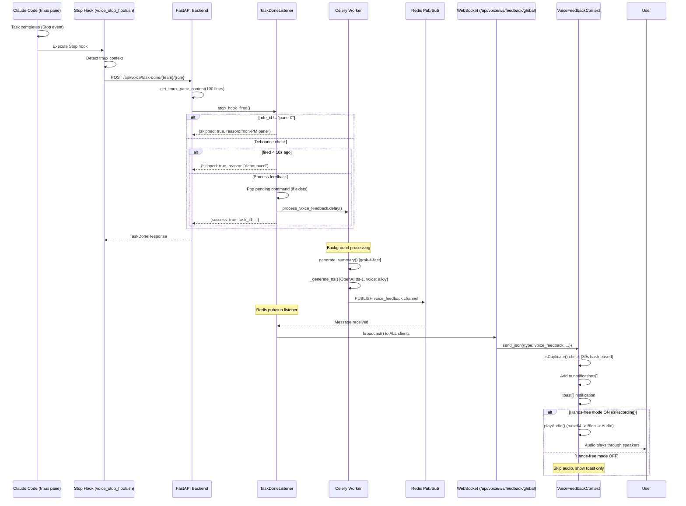
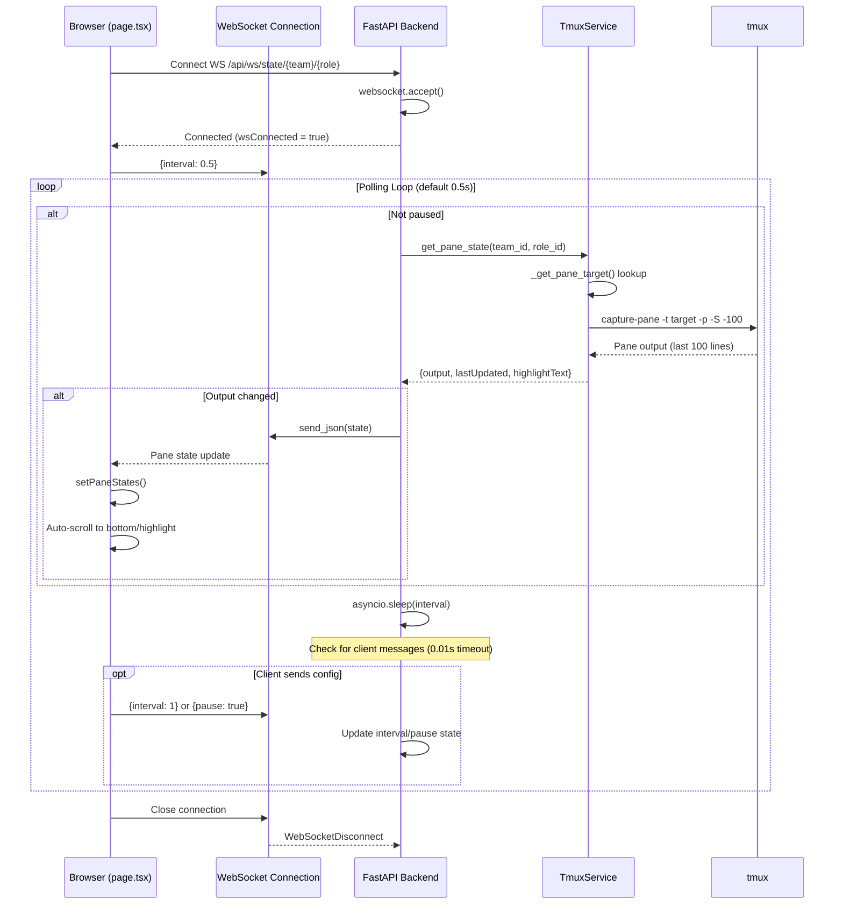
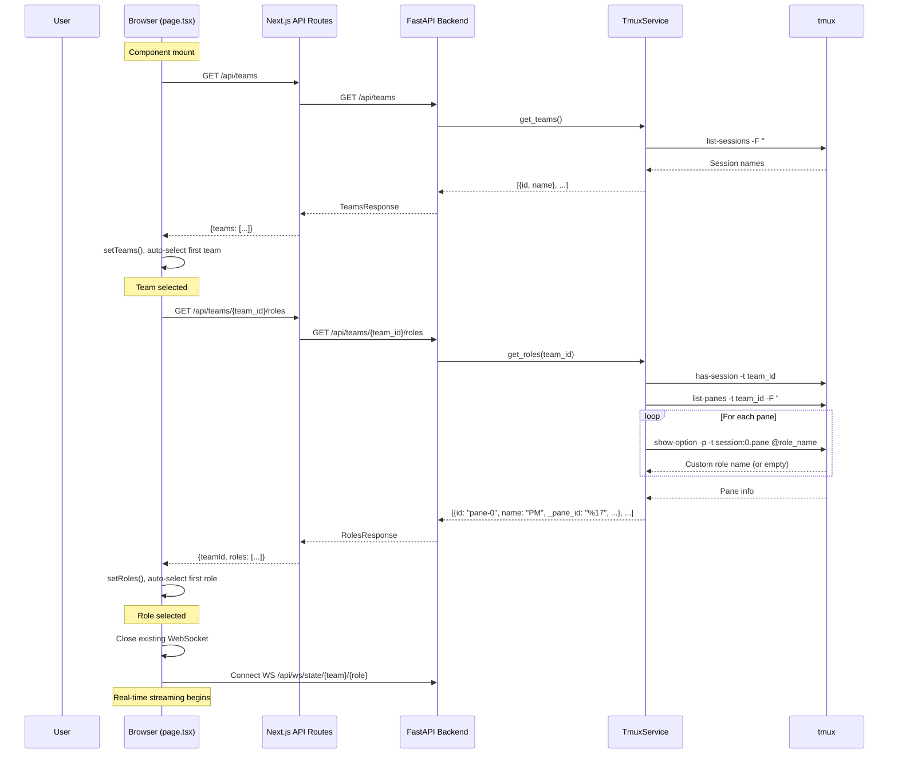

# Main Flows - AI Controller Application

**Last Updated**: 2025-12-10
**Source**: Cross-verified from SA and CR independent codebase analysis

---

## Architecture Overview



---

## 1. Voice Command Flow

Voice input from user's microphone to tmux pane execution.

### Sequence Diagram



### Flow Description

1. **Token Acquisition**: Frontend requests ephemeral token from backend (`POST /api/voice/token`)
2. **WebSocket Connection**: Frontend connects to OpenAI Realtime API using token in subprotocol
3. **Audio Capture**: Browser captures microphone at 24kHz mono, converts Float32 to PCM16 base64
4. **Transcription**: OpenAI server VAD detects speech start/stop, returns transcriptions
5. **Silence Detection**: After 5 seconds of silence, frontend auto-sends command
6. **LLM Correction**: Backend uses grok-4-fast-non-reasoning to correct pronunciation errors
7. **Two-Enter Rule**: Command sent to tmux with 0.3s delay between two Enter presses
8. **Command Tracking**: `TaskDoneListener.command_sent()` stores command for Stop hook correlation

### Audio Configuration

```
Sample Rate: 24000 Hz
Channels: 1 (mono)
Format: PCM16 (signed 16-bit)
VAD Type: server_vad
VAD Threshold: 0.8
Silence Duration: 800ms (before speech_stopped)
Command Timeout: 5000ms (silence before auto-send)
```

### Key Files

| Component | File | Key Functions |
|-----------|------|---------------|
| UI Button | `frontend/components/voice/VoiceCommand.tsx` | `startRecording()`, `stopRecording()` |
| Voice Hook | `frontend/hooks/useVoiceRecorder.ts` | `connectRealtime()`, `setupAudioCapture()` |
| Token API | `backend/app/api/voice_routes.py:66` | `get_voice_token()` |
| Command API | `backend/app/api/voice_routes.py:277` | `process_voice_command()` |
| LLM Correction | `backend/app/api/voice_routes.py:226` | `correct_voice_command()` |
| Tmux Send | `backend/app/api/voice_routes.py:169` | `send_to_tmux_pane()` |

---

## 2. Voice Feedback Flow

Task completion notification from Claude Code Stop hook to user's speakers.

### Sequence Diagram



### Flow Description

1. **Stop Hook Trigger**: Claude Code fires Stop hook when task completes
2. **PM Pane Filter**: Only pane-0 (PM pane) triggers feedback
3. **Debounce**: 10 second window per pane prevents duplicate calls
4. **Celery Task Queue**: Immediate response, background processing
5. **LLM Summary**: grok-4-fast generates 2-3 sentence voice-friendly summary
6. **TTS Generation**: OpenAI tts-1 API generates MP3 audio
7. **Redis Pub/Sub**: Celery worker publishes to `voice_feedback` channel
8. **Global Broadcast**: TaskDoneListener broadcasts to ALL WebSocket clients
9. **Hands-free Check**: Audio only plays when recording is active
10. **Audio Playback**: Browser decodes base64 MP3 and plays via Audio element

### Deduplication Strategy

```
Layer 1 (Server): 10-second debounce per pane (_last_task_done map)
Layer 2 (Server): PM pane only (role_id == "pane-0")
Layer 3 (Client): Hash-based dedup (30s window) - hash = summary|audioLen|first50|last50
Layer 4 (Client): Global playback lock (window.__voiceFeedbackPlaying__)
```

### Message Format (Redis/WebSocket)

```json
{
  "type": "voice_feedback",
  "team_id": "ai_controller_full_team",
  "role_id": "pane-0",
  "summary": "Done. Fixed the authentication bug. Tests passing.",
  "audio": "<base64 encoded MP3>",
  "timestamp": 1702234567890
}
```

### Key Files

| Component | File | Key Functions |
|-----------|------|---------------|
| Stop Hook Endpoint | `backend/app/api/voice_routes.py:345` | `handle_task_done()` |
| Task Done Listener | `backend/app/services/task_done_listener.py` | `stop_hook_fired()`, `_pubsub_loop()` |
| Celery Task | `backend/app/services/celery_tasks.py:43` | `process_voice_feedback()` |
| Summary Generation | `backend/app/services/celery_tasks.py:98` | `_generate_summary()` |
| TTS Generation | `backend/app/services/celery_tasks.py:154` | `_generate_tts()` |
| Global WebSocket | `backend/app/api/voice_routes.py:443` | `global_voice_feedback_websocket()` |
| Frontend Context | `frontend/contexts/VoiceFeedbackContext.tsx` | `handleMessage()`, `playAudio()` |

---

## 3. Pane State Streaming Flow

Real-time tmux pane output updates via WebSocket.

### Sequence Diagram



### Flow Description

1. **WebSocket Connect**: Frontend connects to `/api/ws/state/{team}/{role}` when team+role selected
2. **Initial Config**: Browser sends polling interval (0.5s default)
3. **Polling Loop**: Backend polls tmux every interval using `capture-pane`
4. **Change Detection**: Only sends update when output differs from last send
5. **Configurable**: Client can change interval (0.5, 1, 2s) or pause streaming
6. **Highlight Support**: Tracks sent messages for UI highlighting
7. **Auto-scroll**: Frontend scrolls to highlighted message or bottom

### Polling Configuration

```
Default Interval: 0.5 seconds
Allowed Intervals: [0.5, 1, 2] seconds
Change Detection: output string comparison
Message Format: {output: string, lastUpdated: string, highlightText?: string}
```

### Key Files

| Component | File | Key Functions |
|-----------|------|---------------|
| Frontend State | `frontend/app/page.tsx:44` | `paneStates`, `wsRef` |
| WebSocket Effect | `frontend/app/page.tsx:82` | useEffect for WS connection |
| WS Endpoint | `backend/app/api/routes.py:54` | `websocket_pane_state()` |
| Tmux Service | `backend/app/services/tmux_service.py` | `get_pane_state()` |

---

## 4. Team/Role Selection Flow

Navigation between tmux sessions and panes.

### Sequence Diagram



### Flow Description

1. **Teams Fetch**: On mount, fetch all tmux sessions via `list-sessions`
2. **Auto-select**: First team auto-selected, triggers roles fetch
3. **Roles Fetch**: List panes in session via `list-panes`
4. **Role Name Resolution**:
   - Priority 1: `@role_name` tmux pane option (stable, user-defined)
   - Priority 2: `pane_title` (dynamic, changes with running process)
5. **Role ID**: Uses `pane-{index}` format for API routing
6. **Pane ID**: Stores `%{number}` internally for actual tmux commands
7. **WebSocket**: When role selected, establishes WebSocket for real-time updates

### Data Models

```typescript
// Team
{
  id: string,     // tmux session name
  name: string    // display name (same as id)
}

// Role
{
  id: string,     // "pane-0", "pane-1", etc. (for API routing)
  name: string,   // Display name from @role_name pane option
  order: number,  // Pane index for ordering
  _pane_id: string // "%17", "%18", etc. (internal tmux target)
}
```

### Key Files

| Component | File | Key Functions |
|-----------|------|---------------|
| Team List | `frontend/app/page.tsx:40` | `teams`, `selectedTeam` |
| Role Tabs | `frontend/app/page.tsx:43` | `roles`, `selectedRole` |
| Fetch Teams | `frontend/app/page.tsx:157` | `fetchTeams()` |
| Fetch Roles | `frontend/app/page.tsx:166` | `fetchRoles()` |
| Teams API | `backend/app/api/routes.py:19` | `get_teams()` |
| Roles API | `backend/app/api/routes.py:26` | `get_roles()` |
| Tmux Service | `backend/app/services/tmux_service.py` | `get_teams()`, `get_roles()` |

---

## Key Implementation Details

### Two-Enter Rule

```python
# voice_routes.py - send_to_tmux_pane()
# First send-keys with command + Enter
result1 = subprocess.run(["tmux", "send-keys", "-t", target, command, "C-m"], ...)

# CRITICAL: Wait 0.3s before second Enter
time.sleep(0.3)

# Second Enter - SEPARATE command (Claude CLI requirement)
result2 = subprocess.run(["tmux", "send-keys", "-t", target, "C-m"], ...)
```

### Pane ID Resolution

```python
# tmux_service.py - _get_pane_target()
def _get_pane_target(self, team_id: str, role_id: str) -> Optional[str]:
    # If role_id is already pane_id (%17), use directly
    if role_id.startswith("%"):
        return role_id

    # Otherwise lookup from roles list
    roles = self.get_roles(team_id)
    for role in roles:
        if role["id"] == role_id:
            return role.get("_pane_id")  # Returns %17, %18, etc.
    return None
```

### Voice Feedback Deduplication

```python
# task_done_listener.py - stop_hook_fired()
# Filter: Only process PM pane (pane-0)
if role_id != "pane-0":
    return {"success": True, "skipped": True, "reason": "non-PM pane"}

# 10 second debounce window
elapsed_ms = (now - last_fired).total_seconds() * 1000
if elapsed_ms < self.TASK_DONE_DEBOUNCE_MS:
    return {"success": True, "skipped": True, "reason": "debounced"}
```

---

## File Reference Summary

| Flow | Key Files |
|------|-----------|
| Voice Command | `useVoiceRecorder.ts`, `VoiceCommand.tsx`, `voice_routes.py` |
| Voice Feedback | `task_done_listener.py`, `celery_tasks.py`, `VoiceFeedbackContext.tsx` |
| Pane Streaming | `page.tsx`, `routes.py`, `tmux_service.py` |
| Team/Role Selection | `page.tsx`, `routes.py`, `tmux_service.py` |
| Notification UI | `VoiceNotificationPanel.tsx`, `VoiceNotificationBadge.tsx` |
