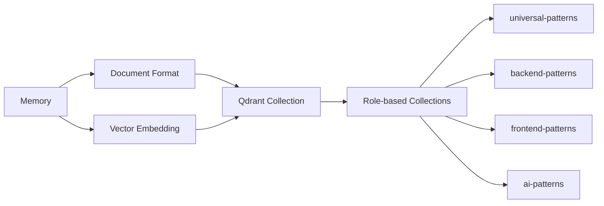
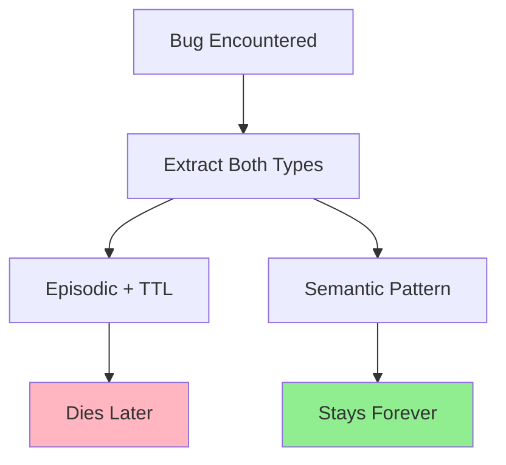
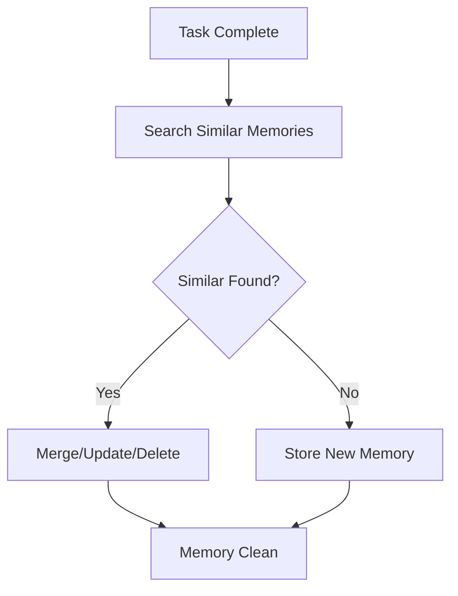
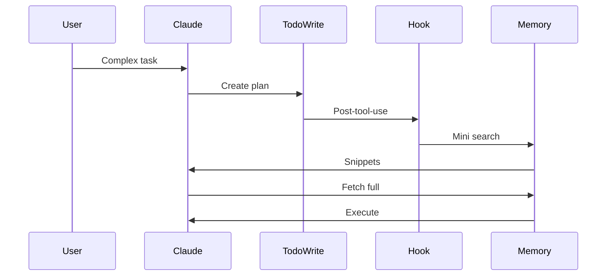
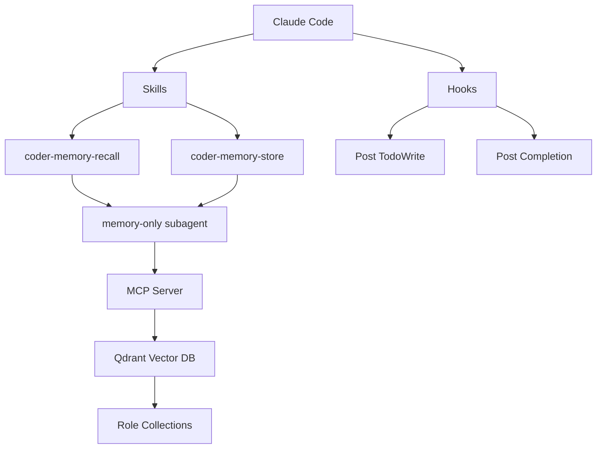

# Memory for Claude Code: A Practical Guide

**DRAFT V7 (Based on V3 + V4/V5 Reviews)**

---

## The Problem

Claude Code keeps forgetting everything - repeats the same bugs daily. Not very useful.

**Memory solves that problem.**

---

## The Solution

I've created a memory package that you can install and use directly with Claude Code. One command, everything works.

**Just want to use it?** Skip to the installation link at the end.

**Want to understand how it works?** Keep reading.

---

# How It Works (Optional)

---

## 1. How: Storage Mechanism

### Theory

People debate page indexes, tree structures, knowledge graphs. But when Google or Anthropic drops a new technology, it'll blow everything out of the water - makes all our current approaches irrelevant. Arguing over 5-10-20% differences? Pointless.

### Our Implementation

**Simple:** Files + Qdrant vector database.



**Key design:**
- MCP server (`src/qdrant_memory_mcp/__main__.py`)
- Two-stage retrieval (mini search engine - see [appendix](#mini-search-engine))
- Role-based collections: backend, frontend, AI, etc.
- In-memory embedding cache

---

## 2. What: Content to Store

### Theory

**First rule: Storing every specific memory is garbage and not useful.**

LangGraph defines three memory types: episodic, semantic, procedural.

### Our Implementation

**Extract both episodic AND semantic simultaneously.** Before storing, search for similar memories - if found, merge or update instead of duplicates.



**Example:**

**Hit Binance API rate limit** → locked out for hours

**Episodic (with TTL):**
```
Binance API hit rate limit of 1200 requests/minute
See file: binance_crawler.py
Tags: #backend #api #binance #rate-limit
```

**Semantic (permanent):**
```
For external APIs, always check rate limits before deployment
Tags: #backend #api #best-practice
```

**Procedural (Team Workflow):**

The current system handles knowledge memory (bugs, patterns) but lacks procedural memory for workflow improvement. For multi-agent teams, the Scrum Master maintains `TEAM_PLAYBOOK.md` based on ACE (Agentic Context Engineering) paper - a self-evolving lessons file with format `[category-ID] helpful=N harmful=N :: lesson content`. After each retrospective, SM updates counters based on observations; lessons with `helpful >= 10, harmful = 0` get promoted to role prompts permanently. This enables teams to improve their process over time, not just their knowledge base.

---

## 3. When: Trigger Conditions

### Theory

Most papers ignore "when" entirely. But in practice, it's the hardest question.

### Our Implementation

**Two triggers in Claude Code:**

#### When to STORE?

**After task completes** (end of while loop)

**Storage process:**



1. Search for similar memories first (mini search engine)
2. If similar: merge, update, or delete conflicting (prioritize newer)
3. If nothing similar: store as new
4. Prevents memory pollution

**Implementation:**
- Hook: `~/.claude/hooks/memory_store_reminder.py` ([docs](#references))
- Random sampling (1/3 chance) to reduce noise

#### When to RETRIEVE?

**When planning tool is called** (`TodoWrite`)



**Why this works:**
- **Selective** - Only complex tasks call TodoWrite
- **Context-aware** - Agent knows what it needs when planning
- **Perfect timing** - Right before execution

**Implementation:**
- Skill: `coder-memory-recall`
- Subagent: `memory-only` (MCP tools only, no file access)
- Hook on TodoWrite post-tool-use ([docs](#references))

---

## Quick Summary

| Question | Theory | Our Implementation |
|----------|--------|-------------------|
| **How** | Files/Vector/Graph | Qdrant + MCP + mini search (2-stage) |
| **What** | Episodic/Semantic/Procedural | Extract both simultaneously, check duplicates |
| **When (Store)** | Various approaches | After task → check duplicates → merge or store |
| **When (Retrieve)** | Often ignored | When TodoWrite called → snippets → pick → fetch |

---

## Architecture Overview



**Components:**
- **MCP Server** - Memory operations via tools
- **Qdrant** - Vector database (Docker container)
- **Skills** - Auto-trigger recall/store with duplicate checking
- **Subagent** - MCP-only (prevents file pollution)
- **Hooks** - Timing triggers

---

## Installation

**One-command install includes:**
- MCP server
- Docker + Qdrant (auto-start)
- Skills (`coder-memory-recall`, `coder-memory-store`)
- Subagent (`memory-only`)
- Configuration (`~/.claude.json`)

**Installation link:** [To be added when package is ready]

---

## Don't Over-Engineer

Memory is THE hot topic (end 2025 → biggest 2026). Anthropic has memory in beta. Google has papers on solving it at the LLM level.

**My advice:** Simple, working solutions beat complex optimizations. The big players will release model-layer memory soon that'll make everything else irrelevant.

If there's memory, coding agents become self-improving. But don't waste time over-engineering.

---

## What's Next

- Installation package (one command)
- Source code release (reverse-engineered Claude Code - separate post)
- Autonomous team framework (memory is the real power)

---

# Appendix & References

## Mini Search Engine

**Problem:** Vector search finds similarity, not relevance.

**Solution:** Two-stage retrieval

**Algorithm:**
1. Search → Get 20-50 results
2. Return only titles + descriptions (2-3 sentences each, like Google snippets)
3. LLM reads all snippets, picks best 3-5
4. Fetch full content only for those
5. **Result:** Consider 50 items but only load 3-4 full docs

**Why:** LLM decides relevance way better than dumb vector rankings.

---

## Other Approaches

**Page Index** - Implemented by some Chinese developers. Core idea: file system + progressive disclosure (see [Anthropic's Skills Documentation](https://www.anthropic.com/engineering/equipping-agents-for-the-real-world-with-agent-skills)). Use prompts to let memory system restructure itself - extremely powerful. I implemented this in V1: slower, had minor issues, but more powerful than vector DB in some contexts. Switched to vector DB for speed/lightness.

**Knowledge Graph** - Works but I don't care.

**Hindsight** - [GitHub repo](https://github.com/vectorize-io/hindsight). I like it, but don't think I should implement it. Beware local optimization trap.

---

## References

**Papers:**
- **Reasoning Bank** (Google, Sept 2025) - [Memory as Test Time Scaling (MaTTS)](https://arxiv.org/pdf/2509.25140)
- **LangChain Agent Memory Paper** - [Procedural, Episodic, Semantic](https://www.blog.langchain.com/memory-for-agents/)
- **ACE: Agentic Context Engineering** (Oct 2025) - [Self-improved agents update prompts](https://www.arxiv.org/pdf/2510.04618)
- **Memory Survey 2025** - [Most comprehensive guide](https://arxiv.org/pdf/2512.13564)
- **Google Nested Learning** - [Warning: will blow us out of water](https://arxiv.org/pdf/2512.24695)

**Documentation:**
- [Claude Code Hooks Documentation] - To be added
- [Anthropic's Skills - Progressive Disclosure](https://www.anthropic.com/engineering/equipping-agents-for-the-real-world-with-agent-skills)
- [Anthropic Memory Tool (Beta)](https://platform.claude.com/docs/en/agents-and-tools/tool-use/memory-tool) - Another warning for anyone thinking they should solve memory themselves

---

**Written:** 2026-01-13
**Status:** DRAFT V7 - V3 base with V4/V5 review feedback
